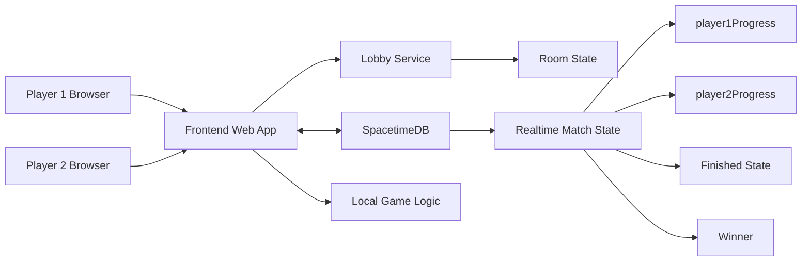

# 🎮 1v1 15 Puzzle

A simple 1v1 multiplayer 15 puzzle game.  
Each player solves their own board and competes based on progress and completion time.

---

## Features

- Create / Join room
- 2 players per room
- Ready system (both players must be ready)
- Same initial puzzle board for both players
- Local game logic (fast interaction)
- Real-time progress comparison (via SpacetimeDB – in progress)
- Result screen (winner, moves, time)

---

## Project Structure

### Frontend (React)
- UI (Lobby, Game, Result)
- Local puzzle logic
- Progress calculation
- API calls to lobby service
- (Next) connect to SpacetimeDB

### Lobby Service (Node.js + Express)
- Create room
- Join room
- Ready system
- Start game when both players are ready

### SpacetimeDB (Planned / In Progress)
- Sync player progress
- Sync finished state
- Determine winner
- Real-time updates

---

## Tech Stack

- Frontend: React + Vite
- Backend: Node.js + Express
- Realtime: SpacetimeDB
- Styling: CSS (Switch-inspired UI)

---
## 🏗️ System Architecture

## Game Flow

1. Player 1 creates a room
2. Player 2 joins using room ID
3. Both players click **Ready**
4. Game starts with the same initial board
5. Each player plays locally
6. Progress is compared in real time
7. First player to finish wins

---

##  API (Lobby Service)

### Create Room
POST /create-room
Body: { "playerName": "Alice" }

---

### Join Room  
POST /join-room  

Body: { "roomId": "ABC123", "playerName": "Bob" }

---

### Ready  
POST /ready  
Body: { "roomId": "ABC123", "playerName": "Alice" }

---

### Get Room State  
GET /room/:roomId

## SpacetimeDB (Planned Interface)

### Client sends
{
  roomId,
  playerName,
  progress,
  isFinished
}

### Client receives
{
  roomId,
  player1,
  player2,
  player1Progress,
  player2Progress,
  player1Finished,
  player2Finished,
  winner
}